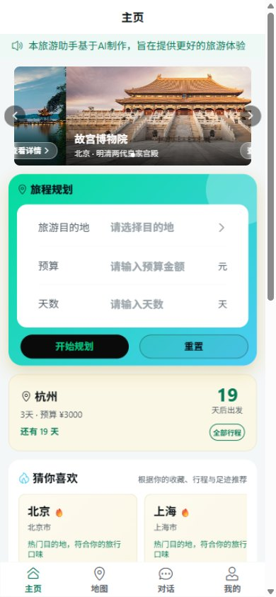
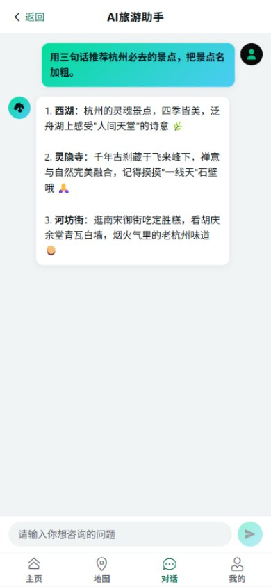
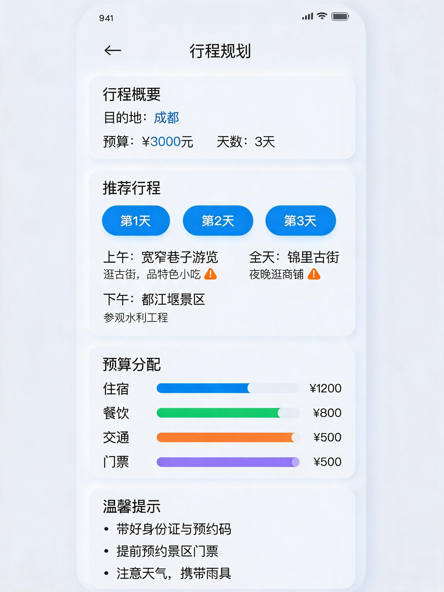
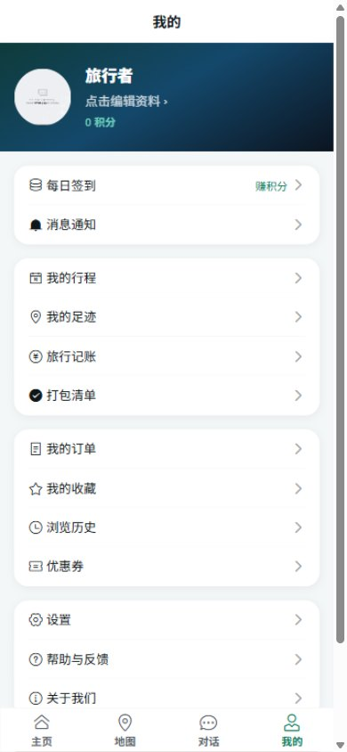

# AI 旅游助手

基于 Vue 3 + Spring Boot 的全栈 AI 旅游规划应用。用户输入目的地、预算、天数，AI 自动生成详细行程规划（含每日景点、预算分配、地图路线），并提供智能对话助手、目的地地图、足迹打卡、游记社区、旅行工具箱等完整功能。

## 功能特性

### AI 与行程
- **AI 行程规划** — 输入目的地/预算/天数，AI 生成逐日行程方案与预算明细
- **AI 行程地图可视化** — 行程中的景点自动匹配真实坐标，按天着色在地图上连线展示
- **AI 行程微调** — 用一句话调整行程（如"第二天太赶了，改轻松点"），可应用并保存
- **AI 对话助手** — 支持流式(SSE)与非流式两种模式，实时旅游问答
- **行程导出** — 生成分享海报长图（html2canvas）+ 导出 .ics 日历文件
- **个性化推荐** — 基于收藏、行程与足迹计算偏好，推荐目的地与景点

### 地图与目的地
- **目的地地图总览** — 城市切换、景点/美食/住宿分类标记（Leaflet + 高德免 Key 瓦片）
- **目的地/景点库** — 20 个热门城市、110+ 地点的完整资料（门票/开放时间/建议游玩/评分）
- **周边探索** — 浏览器定位后搜索附近地点（Haversine 距离排序）
- **足迹打卡地图** — 城市维度标记"去过 / 想去 / 计划中"，生成足迹统计与覆盖省份

### 社区与内容
- **攻略/游记社区** — 发布图文游记、话题标签、最新/最热排序、城市筛选
- **点赞与评论** — 游记点赞、评论、二级回复，触发消息通知
- **景点评价** — 1-5 星评分 + 标签 + 文字评价，含星级分布与热门标签统计

### 旅行工具箱
- **旅行记账本** — 按行程记账，分类饼图 / 每日柱状图（ECharts）+ 预算进度与超支提醒
- **打包清单** — 6 大类 36 项模板一键生成，分组勾选与完成度统计
- **目的地天气** — Open-Meteo 免费预报，未来 7 天，行程页自动嵌入
- **汇率换算** — 20+ 币种实时汇率换算与人民币参考汇率表
- **出行倒计时** — 首页展示距下次出发天数与最近行程卡片

### 账户与协作
- **用户认证** — 注册/登录/登出，BCrypt 密码加密，Token 拦截器鉴权
- **个人资料** — 头像上传、昵称、个性签名、常居地
- **每日签到 + 积分等级** — 连续签到加成，5 级成长体系（旅行新手 → 环球旅行家）
- **消息通知中心** — 点赞/评论/协作/系统通知聚合，未读红点与批量已读
- **多人协作行程** — 分享码/邀请链接加入，成员共同编辑，版本轮询自动同步
- **收藏 / 订单 / 浏览历史** — 原有用户数据管理

### 移动端
- 基于 Vant 4 组件库，开屏动画 + 底部 Tab 导航（主页 / 地图 / 对话 / 我的）

## 项目预览

<table>
  <tr>
    <td align="center"><b>主页</b></td>
    <td align="center"><b>AI 对话</b></td>
    <td align="center"><b>行程规划</b></td>
    <td align="center"><b>我的</b></td>
  </tr>
  <tr>
    <td></td>
    <td></td>
    <td></td>
    <td></td>
  </tr>
</table>

## 技术栈

| 层级 | 技术 |
|------|------|
| 前端 | Vue 3、Vite、Vant 4、Vue Router、Leaflet（地图）、ECharts（图表）、html2canvas（海报） |
| 后端 | Spring Boot 4.1、Spring Web MVC、Spring Data JPA |
| 数据库 | MySQL 8.0（生产）、H2（本地开发可选） |
| AI  | SiliconFlow API（OpenAI 兼容）、DeepSeek-V3 模型；无 Key 时回退内置规则引擎 |
| 外部服务 | Open-Meteo（天气）、open.er-api.com（汇率）、高德栅格瓦片（地图底图）— 均免费无需 Key |
| 鉴权 | BCrypt 密码加密 + Token 拦截器（必须登录 / 可选登录两种拦截器） |
| 构建 | Maven（后端）、npm（前端） |

## 设计规范

界面采用「青绿 / 天青」色系，**默认浅色（白天）主题**，可在「我的 - 设置」中切换为深色（黑色）主题。全部令牌集中在 `travel/src/style.css`：`:root` 为浅色，`html.dark` 覆盖为深色，改一处即可全局生效。

### 主题切换

- 入口：`我的 → 设置 → 深色模式`（可选「跟随系统」）
- 实现：`travel/src/utils/theme.js` 给 `<html>` 加 / 去 `dark` 与 `van-theme-dark` 类，选择持久化在 `localStorage.travel_theme`（`light` / `dark`），默认 `light`
- 防闪屏：`index.html` 内联脚本在首屏渲染前应用已保存主题，并同步 `<meta name="theme-color">`

### 设计令牌

| 令牌 | 浅色（默认） | 深色 | 用途 |
|---|---|---|---|
| `--brand` | `#04C489` | `#04DC9C` | 主色：青绿（选中、进度、强调） |
| `--brand-2` | `#2BA6D8` | `#4CCCF4` | 次主色：天青 |
| `--brand-ink` | `#05121A` | `#05121A` | 亮色渐变块上的文字（近黑） |
| `--brand-deep` | `#067A58` | `#2FE0A8` | 当前主题底上的强调文字（达 AA） |
| `--accent-text` | `#1673A3` | `#4CCCF4` | 强调文字 |
| `--danger` | `#D81B3F` | `#FF6B70` | 危险 / 价格文字（深色下用亮红保证可读） |
| `--ink` | `#0A0A0A` | `#0A0A0A` | 深色按钮 / 深色主视觉底色 |
| `--surface` | `#FFFFFF` | `#161616` | 卡片面 |
| `--surface-2` | `#F1F4F5` | `#1C1C1C` | 次级卡片面 |
| `--bg` | `#F4F7F8` | `#0B0B0B` | 页面底 |
| `--line` | `#E2E8EA` | `#262B2D` | 分隔线、描边 |
| `--text` / `--text-2` / `--text-3` | `#10171A` / `#56626A` / `#5F6B71` | `#F2F5F6` / `#9AA3A9` / `#7C858C` | 主 / 次 / 弱文字 |
| `--tag-attraction` / `--tag-food` / `--tag-hotel` | `#1F6FBF` / `#B25A00` / `#067A58` | `#BCE4FC` / `#4CCCF4` / `#04DC9C` | 类型标签色（随主题变化） |
| `--grad-brand` | 青绿→天青（两套主题一致） | 同左 | 主视觉、主按钮、选中态 |
| `--grad-dark` | 深青→深蓝（两套主题一致，白字安全） | 同左 | 深色主视觉卡片 |

设计原则：

- 两套主题只切换「底色 / 面板 / 文字 / 描边」与少量强调色，渐变主视觉保持一致，切主题不改变品牌观感；
- 顶栏与底部导航：浅色为白底深字，深色为近黑底浅字，选中态均用青绿；
- 主按钮为「青绿→天青渐变 + 近黑粗体字」，因此按钮文字用 `--brand-ink`，避免白字落在亮渐变上不可读；
- 地图底图为浅色瓦片，图钉用固定深色（`TYPE_COLORS`）；类型标签改用主题令牌 `--tag-*`，浅色/深色自动适配；
- 正文对比度按 WCAG AA 校验（正文 ≥ 4.5:1，大字 ≥ 3:1），两套主题均已逐页审计通过。

> 注意事项：
> 1. 主题文件必须在 `vant/lib/index.css` 之后导入（见 `travel/src/main.js`），否则 `:root` 变量会被 Vant 默认值覆盖；
> 2. Vant 的 `--van-button-plain-background` 默认为白色，已在主题中覆盖为透明；
> 3. 深色主题下 `--danger` 使用亮红（`#FF6B70`）保证文字可读，危险按钮填充色单独用 `--danger-fill`。

## 项目结构

```
Travel/
├── travel/                      # 前端 Vue 3 项目
│   ├── src/
│   │   ├── api/                 # 接口封装（auth/chat/plan/trip/dest/checkin/review/social/
│   │   │                        #   expense/packing/weather/exchange/collab/recommend/
│   │   │                        #   profile/signin/notify/favorite/order）
│   │   ├── components/          # 组件（MapContainer 地图、TripExport 导出、TripRefine 微调、
│   │   │                        #   TripCollab 协作、TripCountdown 倒计时、ReviewSection 评价、
│   │   │                        #   RecommendSection 推荐、FeatureEntry 功能宫格 等）
│   │   ├── views/               # 页面（Home/MapView/DestinationLib/AttractionDetail/Footprint/
│   │   │                        #   Nearby/PostList/PostDetail/PostPublish/Expense/Packing/
│   │   │                        #   Weather/Exchange/MyTrips/TripDetail/CollabJoin/
│   │   │                        #   ProfileEdit/SignIn/Notifications/PlanResult/Chat/...）
│   │   ├── router/              # 路由配置 + 登录守卫
│   │   ├── utils/               # auth token、coord 坐标转换、export 导出工具
│   │   └── App.vue              # 根组件 + 开屏动画 + Tab 导航
│   └── vite.config.js           # Vite 配置（/api 代理到后端 1200 端口）
│
├── travel-server/               # 后端 Spring Boot 项目
│   ├── src/main/java/com/example/travelserver/
│   │   ├── controller/          # 接口层（Auth/Travel/Trip/Destination/Checkin/Review/
│   │   │                        #   Post/Expense/Packing/Weather/Exchange/Collab/
│   │   │                        #   Recommend/Profile/SignIn/Notification/Order/Favorite）
│   │   ├── service/             # 业务层（user / travel / dest / ai / social 分包）
│   │   ├── entity/              # JPA 实体（User/City/Attraction/Trip/Favorite/TravelOrder/
│   │   │                        #   Checkin/AttractionReview/Post/PostLike/PostComment/
│   │   │                        #   Expense/PackingItem/SignInRecord/Notification/
│   │   │                        #   TripShare/TripCollaborator）
│   │   ├── repository/          # JPA Repository
│   │   ├── dto/ vo/             # 请求 DTO / 响应 VO
│   │   ├── common/              # BusinessException, GlobalExceptionHandler, UserContext
│   │   └── config/              # AuthInterceptor(必须登录)、OptionalAuthInterceptor(可选登录)、
│   │                            #   WebConfig、DataSeeder(种子数据)、TravelAiProperties
│   └── src/main/resources/
│       ├── application.yml       # 主配置（数据库 + AI + 上传限制）
│       └── application-local.yml # 本地私有配置（已 gitignore）
│
└── .gitignore
```

## 快速开始

### 环境要求

- **Node.js** >= 18
- **Java** >= 17
- **Maven** >= 3.8（或使用项目自带 mvnw）
- **MySQL** 8.0+（可选，无 MySQL 时可用 H2 内存库）

### 1. 克隆项目

```bash
git clone <repo-url>
cd Travel
```

### 2. 启动后端

```bash
cd travel-server

# 方式一：使用 Maven Wrapper
./mvnw spring-boot:run

# 方式二：使用系统 Maven
mvn spring-boot:run
```

后端启动后监听 **1200** 端口。首次启动会自动初始化种子数据（20 个城市、110+ 个地点）。

### 3. 启动前端

```bash
cd travel
npm install
npm run dev
```

前端开发服务器启动后，`/api` 请求会自动代理到后端 `http://127.0.0.1:1200`。

### 4. 数据库配置

**使用 MySQL（默认）：**

```sql
CREATE DATABASE travel CHARACTER SET utf8mb4 COLLATE utf8mb4_unicode_ci;
```

默认账号 `root`、密码 `root`，如需修改请编辑 `travel-server/src/main/resources/application.yml`。

**使用 H2 内存库（无需安装 MySQL）：**

在 `application-local.yml`（已 gitignore，需自行创建）中覆盖数据源：

```yaml
spring:
  datasource:
    url: jdbc:h2:mem:travel;DB_CLOSE_DELAY=-1;MODE=MySQL
    username: sa
    password:
    driver-class-name: org.h2.Driver
```

### 5. 配置 AI API Key

在 `application-local.yml` 中配置 SiliconFlow API Key：

```yaml
travel:
  ai:
    siliconflow:
      api-key: your-api-key-here
```

或通过环境变量注入（推荐，避免密钥进入文件）：

```bash
export SILICONFLOW_API_KEY=your-api-key-here
```

> 如未配置 API Key，请将 `travel.ai.provider` 设为 `mock`，AI 功能将回退到内置规则引擎，可离线体验全部功能（行程 POI 坐标会用目的地高分景点自动补齐）。

### 6. 文件上传目录

头像上传默认保存在后端运行目录的 `uploads/` 下（已 gitignore），可通过配置修改：

```yaml
travel:
  upload:
    dir: uploads
```

访问路径为 `/uploads/avatar/xxx.png`。

## API 接口

所有接口统一前缀 `/api`，响应格式 `{ "code": 200, "message": "...", "data": ... }`。

### 认证与用户

| 方法 | 路径 | 说明 | 鉴权 |
|------|------|------|------|
| POST | `/api/auth/register` | 注册 | 否 |
| POST | `/api/auth/login` | 登录 | 否 |
| POST | `/api/auth/logout` | 登出 | 是 |
| GET | `/api/user/info` | 当前用户信息 | 是 |
| GET/PUT | `/api/profile` | 个人资料查询/更新 | 是 |
| POST | `/api/profile/avatar` | 头像上传（multipart） | 是 |
| GET | `/api/signin/status` | 签到状态（日历/积分/等级） | 是 |
| POST | `/api/signin` | 执行签到 | 是 |
| GET | `/api/notify/list` | 通知列表 | 是 |
| GET | `/api/notify/unread-count` | 未读数量 | 是 |
| POST | `/api/notify/{id}/read` | 标记已读 | 是 |
| POST | `/api/notify/read-all` | 全部已读 | 是 |
| DELETE | `/api/notify/{id}` · `/clear` | 删除 / 清空通知 | 是 |

### 目的地与地图

| 方法 | 路径 | 说明 | 鉴权 |
|------|------|------|------|
| GET | `/api/dest/cities` | 城市列表（热门优先） | 否 |
| GET | `/api/dest/cities/{id}` | 城市详情 | 否 |
| GET | `/api/dest/attractions` | 地点列表（cityId/type/keyword） | 否 |
| GET | `/api/dest/attractions/{id}` | 地点详情 | 否 |
| GET | `/api/dest/nearby` | 附近地点（lat/lng/radiusKm/type） | 否 |
| GET | `/api/weather` | 城市天气预报 | 否 |
| GET | `/api/weather/coords` | 坐标天气 | 否 |
| GET | `/api/exchange` | 汇率换算 | 否 |
| GET | `/api/recommend` | 个性化推荐 | 是 |

### 行程与协作

| 方法 | 路径 | 说明 | 鉴权 |
|------|------|------|------|
| POST | `/api/travel/plan` | 生成行程规划（destination/budget/days） | 否 |
| POST | `/api/travel/refine` | AI 行程微调 | 否 |
| POST | `/api/ai/chat` | AI 对话（非流式，一次性返回） | 否 |
| POST | `/api/ai/chat/stream` | AI 对话（SSE 流式增量） | 否 |
| POST | `/api/trip/save` | 保存行程 | 是 |
| GET | `/api/trip/list` · `/api/trip/{id}` | 我的行程列表 / 详情 | 是 |
| PUT | `/api/trip/{id}` | 更新行程 | 是 |
| DELETE | `/api/trip/{id}` | 删除行程 | 是 |
| POST | `/api/collab/share` | 创建/获取分享码 | 是 |
| GET | `/api/collab/info` | 分享信息（凭 code） | 是 |
| POST | `/api/collab/join` | 加入协作 | 是 |
| GET | `/api/collab/trips` | 我参与的协作行程 | 是 |
| GET/POST | `/api/collab/trips/{tripId}` | 协作行程详情 / 编辑保存 | 是 |
| GET | `/api/collab/trips/{tripId}/members` | 成员列表 | 是 |
| DELETE | `/api/collab/trips/{tripId}/members/{memberId}` | 移除成员/退出 | 是 |

### 足迹、社区与工具

| 方法 | 路径 | 说明 | 鉴权 |
|------|------|------|------|
| GET | `/api/checkin/list` · `/stats` | 足迹列表 / 统计 | 是 |
| POST | `/api/checkin/mark` | 打卡（cityId/status/note） | 是 |
| DELETE | `/api/checkin/remove` | 取消打卡 | 是 |
| GET | `/api/social/posts` | 游记列表（city/keyword/mine/sort） | 可选 |
| GET | `/api/social/posts/liked` | 我点赞的游记 | 是 |
| GET | `/api/social/posts/{id}` | 游记详情 | 可选 |
| POST | `/api/social/posts` | 发布游记 | 是 |
| POST | `/api/social/posts/{id}` | 编辑游记 | 是 |
| DELETE | `/api/social/posts/{id}` | 删除游记 | 是 |
| POST | `/api/social/posts/{id}/like` | 点赞/取消 | 是 |
| GET | `/api/social/posts/{id}/comments` | 评论列表 | 可选 |
| POST | `/api/social/comments` | 发表评论 | 是 |
| DELETE | `/api/social/comments/{id}` | 删除评论 | 是 |
| GET | `/api/review/list` · `/summary` | 评价列表 / 汇总 | 可选 |
| GET | `/api/review/mine` | 我的评价 | 是 |
| POST | `/api/review` | 提交/更新评价 | 是 |
| DELETE | `/api/review/{id}` | 删除评价 | 是 |
| POST/GET | `/api/expense` · `/list` · `/stats` | 记账新增/列表/统计 | 是 |
| DELETE | `/api/expense/{id}` | 删除记账 | 是 |
| GET | `/api/packing/list` | 打包清单（分组+进度） | 是 |
| POST | `/api/packing` | 新增条目 | 是 |
| POST | `/api/packing/{id}/toggle` | 勾选/取消 | 是 |
| POST | `/api/packing/template` | 套用模板 | 是 |
| DELETE | `/api/packing/{id}` · `/clear` | 删除 / 清空 | 是 |
| POST | `/api/favorite/add` · `GET /list` · `DELETE /{id}` · `GET /check` | 收藏管理 | 是 |
| POST | `/api/order/create` · `GET /list` · `DELETE /{id}` | 订单管理 | 是 |

## 配置说明

### AI 对话接口协议

两个对话端点共用同一请求体：

```json
{ "message": "必填，≤1000 字", "sessionId": "可选，首轮不传", "history": "可选，最多取最近 20 条" }
```

**非流式** `POST /api/ai/chat` → `Result<ChatReplyVO>`，`data` 字段：`reply / sessionId / role / timestamp / provider`。

**流式** `POST /api/ai/chat/stream` → `text/event-stream`，事件名与 `data.type` 一致（前端按任一字段均可解析）：

```
event: meta   data: {"type":"meta","sessionId":"sess-xxx","provider":"siliconflow"}
event: delta  data: {"type":"delta","content":"增量片段"}            // 可多次
event: done   data: {"type":"done","sessionId":"sess-xxx","provider":"siliconflow","chars":123}
event: error  data: {"type":"error","message":"可读错误信息"}
```

约定与实现要点：

- 参数校验（空消息 / 超长）发生在建立 SSE **之前**，按项目统一约定返回 `HTTP 200 + {code:400,message}`，前端按 `Content-Type` 区分 JSON 与 SSE；
- 流建立后的异常通过 `error` 事件下发，不再抛 HTTP 错误；
- 每 15 秒发送一次 `:ping` 注释行保活，客户端忽略注释行即可；
- 响应头带 `Cache-Control: no-cache, no-transform`、`X-Accel-Buffering: no`，避免各级缓冲导致增量延迟；
- 会话历史在服务端按 `sessionId` 维护（`MAX_HISTORY=20`），首个 `meta` 事件即回传新 `sessionId`；
- 前端 `travel/src/api/chat.js`：`streamChat`（流式，支持 `AbortController` 停止生成）与 `sendChat`（非流式兜底）；
- 前端展示时由 `travel/src/utils/aiText.js` 把 AI 输出的 Markdown 渲染为真实排版（加粗/列表/代码），**气泡中不再出现 `*`、`#` 等符号**。

> 说明：真实模型的「首字延迟」（TTFT）通常为 1–8 秒，此期间界面显示「正在思考…」，随后数百个 `delta` 事件逐段上屏。

### AI 提供方切换

在 `application.yml` 中切换 `travel.ai.provider`：

| 值 | 说明 |
|----|------|
| `siliconflow` | 调用 SiliconFlow 真实大模型（需 API Key） |
| `mock` | 内置规则引擎，无需 Key，离线可用 |

### 坐标系说明

地点坐标以 WGS-84 存储；地图底图使用高德栅格瓦片（GCJ-02），前端通过 `utils/coord.js` 自动做 WGS-84 → GCJ-02 转换，保证标记点落位准确。

### 鉴权说明

- `AuthInterceptor`：必须登录的接口（行程、足迹、记账、打包、个人资料等），未登录返回 401
- `OptionalAuthInterceptor`：可匿名浏览的内容（游记、评价），带了合法 token 则识别用户以返回"是否已点赞"等个性化字段；写操作在 Controller 内校验登录

### 安全说明

- `application-local.yml` 已在 `.gitignore` 中排除，**切勿提交到版本库**
- API Key 推荐通过环境变量 `SILICONFLOW_API_KEY` 注入
- 用户密码使用 BCrypt 加密存储
- 上传文件仅允许 jpg/png/gif/webp 且限制 5MB，保存在 gitignore 的 `uploads/` 目录

## 开发说明

- 前端代理：Vite 开发服务器将 `/api` 代理到 `http://127.0.0.1:1200`，生产环境需配置 Nginx 反向代理
- JPA DDL：`ddl-auto: update`，实体变更会自动同步表结构
- 种子数据：应用启动时若城市表为空，`DataSeeder` 自动写入内置城市与景点数据
- 路由守卫：需登录的页面未登录时自动跳转登录页
- **热门景点图片**：存放在 `travel/public/spots/`，按景点 ID 命名（如 `1.jpg` 对应故宫博物院），替换同名文件即可换图；文件缺失时首页卡片会自动回退为渐变占位。当前图片取自公开图片搜索，仅用于演示，生产环境请替换为自有或已授权图片。

## License

MIT
